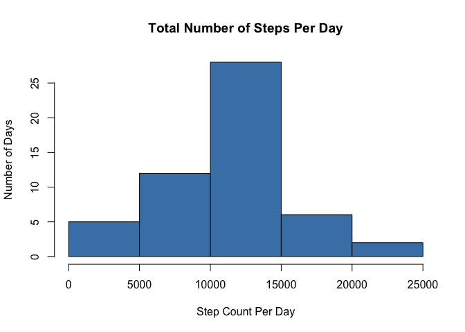
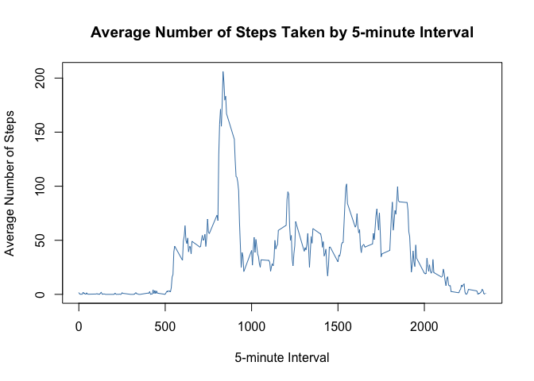
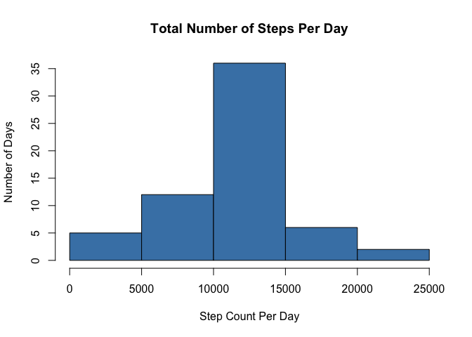
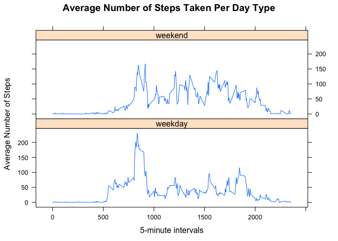

# Reproducible Research: Peer Assessment 1


```r
# Load the lattice library (used near the end)
library(lattice)
```


## Loading and preprocessing the data

### Data Source

[Activity Monitory Data](https://d396qusza40orc.cloudfront.net/repdata%2Fdata%2Factivity.zip) [52k]

This data is stored as a comma-delimited text file with a total of 17,568 observations.

### Variables

 - **steps** - Number of steps taken in a 5-minute interval (missing values are coded as NA)
 - **data** - The date on which the measurement was recorded (YYYY-MM-DD)
 - **interval** - Identifier for the 5-minute interval in which the measurement was taken


1. Setup the environment


```r
# Define the constants
sourceZipFile <- 'activity.zip'
sourceFile <- 'activity.csv'

# Check if the file exists
if(!file.exists(sourceFile)) {
    # It doesn't exist, so unzip the file
    unzip(sourceZipFile)
}

# Have we already loaded the data?
if(!exists('activity_data')) {
    # We haven't, so read the data in
    activity_data <- read.csv(sourceFile, colClasses = c('numeric', 'character', 'numeric'))
}
```

2. Process/transform the data (if necessary) into a format suitable for your analysis


```r
# Coerce the proper data type for the date
activity_data$date <- as.Date(activity_data$date, '%Y-%m-%d')
```

## What is mean total number of steps taken per day?

1. Calculate the total number of steps taken per day.


```r
# Aggregate the number of steps by day ignoring any "NA" values
steps_per_day <- aggregate(
    steps ~ date,
    data = activity_data,
    sum,
    na.rm = TRUE
)
```

2. If you do not understand the difference between a histogram and a barplot, research the difference between them.  Make a histogram of the total number of steps taken each day.


```r
# Draw the graph
with(
    steps_per_day,
    hist(
        steps,
        main = 'Total Number of Steps Per Day',
        xlab = 'Step Count Per Day',
        ylab = 'Number of Days',
        col = 'steelblue'
    )
)
```

\

3. Calculate and report the mean and median of the total number of steps taken per day.


```r
# Calculate the mean and median excluding any NA records
steps.mean <- mean(steps_per_day$steps, na.rm = TRUE)
steps.median <- median(steps_per_day$steps, na.rm = TRUE)
```

The mean number of steps per day was: **10,766.19**.

The median number of steps per day was: **10,765**.

## What is the average daily activity pattern?

1. Make a time series plot (i.e. `type="l"`) of the 5-minute interval (x-axis) and the average number of steps taken, averaged across all days (y-axis).


```r
# Calculate the steps per interval
intervals <- aggregate(
    steps ~ interval,
    data = activity_data,
    mean,
    na.rm = TRUE
)

# Graph the results
with(
    intervals,
    plot(
        interval,
        steps,
        type = 'l',
        xlab = '5-minute Interval',
        ylab = 'Average Number of Steps',
        main = 'Average Number of Steps Taken by 5-minute Interval',
        col = 'steelblue'
    )
)
```

\

2. Which 5-minute interval, on average across all days in the dataset, contains the maximum number of steps?


```r
# Calculate the maximum number of steps
info.max_steps <- max(intervals$steps)

# Find the interval that matched this maximum number of steps
info.max_interval <- intervals[intervals$steps == info.max_steps, ]$interval
```

The 5-minute interval that on average contained the maximum number of steps was **835**.

## Imputing missing values

1. Calculate and report the total number of missing values in the dataset (i.e. the total number of rows with NAs).


```r
# Sum up the number of "NA" records
info.na_count <- sum(is.na(activity_data$steps))
```

The total number of missing values in this data set is **2304**.

2. Devise a strategy for filling in all of the missing values in the dataset.  The strategy does not need to be sophisticated.  For example, you could use the mean/median for that day, or for that 5-minute interval, etc.

The strategy that I plan to use in order to derive the missing values in the dataset is to use the calculated mean values (by interval) and apply it to the respective invervals.

We will take the previously calculated mean and merge it into our main data set to generate our completed data.


```r
# Add the interval means onto the activity data
activities.imputed <- merge(activity_data, intervals, by = 'interval', suffixes = c('', '.y'))
```

3. Create a new dataset that is equal to the original dataset but with the missing data filled in.


```r
# Overwrite the NA step values with the means
activities.imputed[is.na(activities.imputed$steps), ]$steps <- activities.imputed[is.na(activities.imputed$steps), ]$steps.y
```

4. Make a histogram of the total number of steps taken each day and calculate and report **mean** and **median** total number of steps taken per day.  Do these values differ from the estimates from the first part of the assignment?  What is the impact of imputing missing data on the estimates of the estimates of the total daily number of steps?


```r
# Aggregate the number of steps by day
steps_per_day <- aggregate(
    steps ~ date,
    data = activities.imputed,
    sum
)

# Generate a histogram
with(
    steps_per_day,
    hist(
        steps,
        main = 'Total Number of Steps Per Day',
        xlab = 'Step Count Per Day',
        ylab = 'Number of Days',
        col = 'steelblue'
    )
)
```

\

```r
# Calculate the mean and median values
updated.mean <- mean(steps_per_day$steps)
updated.median <- median(steps_per_day$steps)

# How far do these differ from the previous values?
diff.mean <- ((steps.mean - updated.mean) / steps.mean) * 100
diff.median <- ((steps.median - updated.median) / steps.median) * 100
```

The updated mean number of steps per day was: **10,766.19**.

The updated median number of steps per day was: **10,766.19**.

After imputing, both the mean and median are now identical.

After imputing the mean value has changed by **0.000%** and the median value has changed by **-0.011%**.

## Are there differences in activity patterns between weekdays and weekends?

1. Create a new factor variable in the dataset with two levels - "weekday" and "weekend" indicating whether a given date is a weekday or weekend day.


```r
# Derive the type of day it is (i.e. weekend/weekday)
activities.imputed$day_type <- as.factor(
    ifelse(
        weekdays(activities.imputed$date) %in% c('Saturday', 'Sunday'),
        'weekend',
        'weekday'
    )
)
```

2. Make a panel plot containing a time series plot (i.e. `type = 'l'`) of the 5-minute interval (x-axis) and the average number of steps taken, averaged across all weekday days or weekend days (y-axis).  See the README file in the GitHub repository to see an example of what this plot should look like using simulated data.


```r
# Find the mean of the data split out by the day types
daily_activity <- with(
    activities.imputed,
    aggregate(
        steps,
        list(interval = interval, day_type = day_type),
        mean
    )
)

# Now that it is all split out, let's graph it using ggplot2
xyplot(
    x ~ interval | day_type,
    data = daily_activity,
    type = 'l',
    layout = c(1, 2),
    main = 'Average Number of Steps Taken Per Day Type',
    xlab = '5-minute intervals',
    ylab = 'Average Number of Steps'
)
```

\

It appears as though weekends are the most active time for the people in the study.
